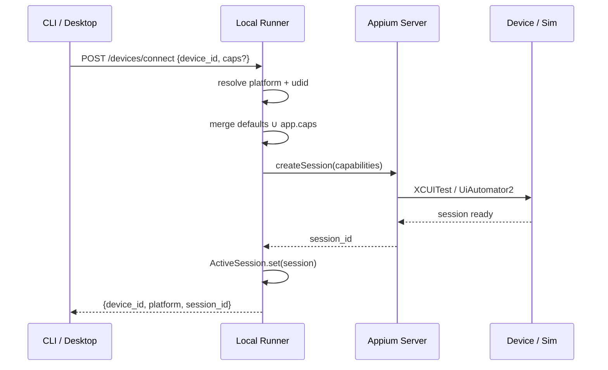
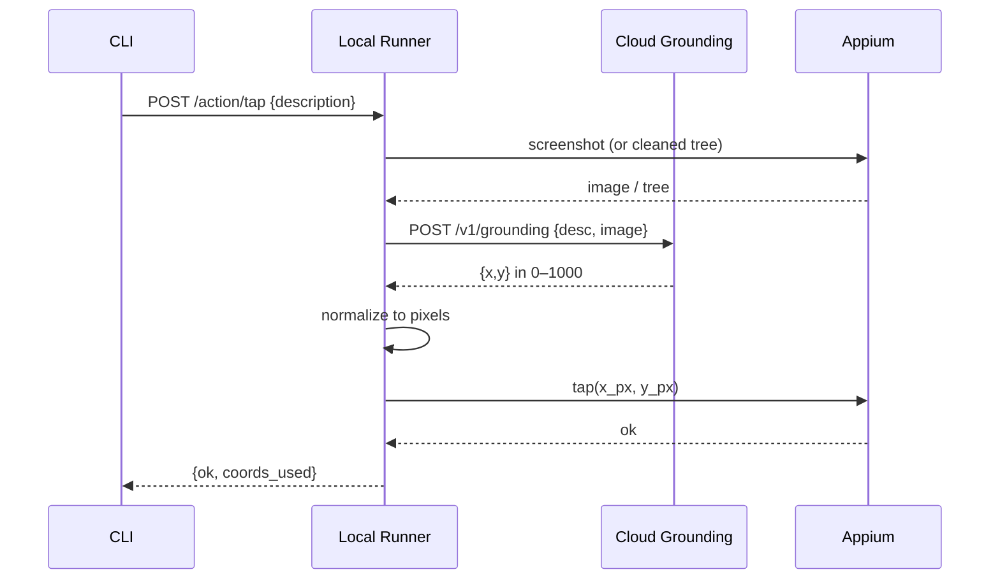
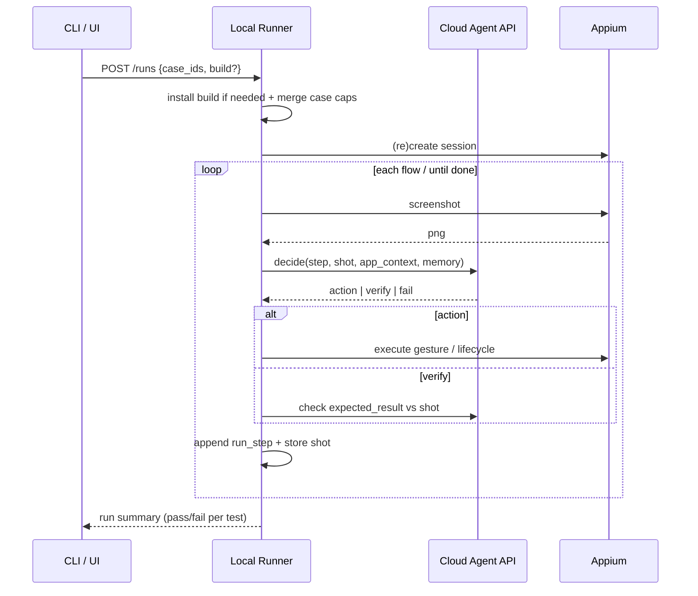

# noqa-like Agentic QA — Feature Spec & Build Architecture

This document captures **what noqa does** (from [docs](https://docs.noqa.ai/llms.txt), [Appium capabilities](https://docs.noqa.ai/guide/best-practices-appium-capabilities), [CLI](https://docs.noqa.ai/docs/cli), [agent guide](https://docs.noqa.ai/guide/how-noqa-agent-works), [GitHub](https://github.com/noqa-ai/noqa)) and **how we would rebuild an equivalent system**, informed by the shipped Mac app (`noqa.app` v2.0.12).

Related: `HOW_IT_WAS_BUILT.md` (reverse-engineered stack facts).

---

## 1. Product thesis

**Visual, natural-language mobile QA.** An agent tests iOS/Android apps and games from screenshots (and optional cleaned accessibility trees for coding agents), without locator scripts. Device control is **Appium under the hood** ([docs](https://docs.noqa.ai/guide/best-practices-appium-capabilities)): XCUITest (iOS) / UiAutomator2 (Android).

Two complementary modes:

| Mode | Who decides each step | Who pays / when |
|------|------------------------|-----------------|
| **Device connector (CLI)** | External coding agent (`noqa screen` → `noqa action` loop) | Free when signed in |
| **noqa agent (runs)** | noqa’s autonomous perception→decision→action loop | Paid credits |

---

## 2. Complete feature inventory

### 2.1 Desktop app (macOS)

- Local host for Appium + device sessions
- Account sign-in (cloud features, grounding, test management)
- Settings → Tools: **Install CLI**, **Install skill** (`noqa-testing`)
- Local device / simulator browsing and connection
- Dashboard-like UX for apps, cases, runs, builds (also mirrored in web)
- Auto-update (Tauri updater via CDN)

### 2.2 Device layer (Appium)

- Discover iOS devices & simulators / Android devices & emulators
- Connect session to a device id
- Install / launch apps from local builds (`.ipa`, `.app`, `.apk`)
- Screenshot capture
- Raw accessibility tree (`screen --full`)
- Gestures: tap / double / long-press, swipe, drag, text input
- App lifecycle: activate, terminate, restart, background
- System: open URL/deeplink, accept/dismiss alerts
- **Custom Appium capabilities** (app-level + case-level; case overrides app):
  - e.g. `appium:autoLaunch=false`
  - Android: `appium:appActivity`, `appium:appWaitActivity` (wildcards)

### 2.3 Screen reading (for coding agents)

| API | Purpose | Cost (docs) |
|-----|---------|-------------|
| `screen` | Cleaned element tree + relative coords 0–1000 | ~1× tokens |
| `screen --full` | Raw Appium tree | ~7× |
| `screenshot` | PNG for vision | ~2× |

### 2.4 Automatic grounding

- `action … -d "Blue login button"` → server/model maps description → coordinates
- Fallback: explicit `--x/--y` (0–1000)

### 2.5 Autonomous agent (paid)

Perception → Decision → Action loop from **screenshots** ([how it works](https://docs.noqa.ai/guide/how-noqa-agent-works)):

- Actions: tap, swipe, drag, input, open link, terminate/background/activate app
- Works across app + system UI (alerts, IAP, home, other apps)
- Speed: ~5–10s/action cold; ~1–2s with memory of similar screens
- Limits: short-lived UI may be missed; keep tests &lt; ~100 actions

### 2.6 Test authoring model

```
App
├── identifiers: name, bundle_id / package_name, store ids
├── app_context (shared rules, credentials, screen names)
├── appium_capabilities (defaults)
├── Tags
├── Reusable Flows (name, instructions, result)
├── Test Cases
│   ├── title, tags[]
│   ├── flows[] → inline {instructions, result} OR {id: reusableFlowId}
│   └── case-level appium_capabilities (override)
└── Builds (.ipa/.app/.apk, metadata)
Runs
└── cases[] → per-test pass/fail, steps, screenshots/video
```

### 2.7 CLI surface (must implement)

```
devices ios|android [--all]
devices connect <id> | active

screen [--full]
screenshot <path>

action tap|swipe|drag|input …   # -d / --x --y / flags
action open-url|alert|activate-app|terminate-app|restart-app|background-app

apps list|get|update
cases list|get|create|update|delete
flows list|get|create|update|delete
tags <APP>
builds list|create|delete
runs create|list|get|delete

--json on read commands
```

### 2.8 Cloud & platform

- Upload builds; run on remote real devices
- Parallel runs, locale/location/preload config
- Public API (API key): apps, builds (+ presigned upload), cases, devices, runs
- CI/CD via API
- Integrations (team): Slack, Jira, webhooks, MCP
- Local vs cloud matrix: TestFlight/simulators local-only; parallel/CI/cloud config cloud-only ([local vs cloud](https://docs.noqa.ai/guide/local-vs-cloud))

### 2.9 Agent skill

Ship `skills/noqa-testing` (markdown workflows) so Cursor/Claude/Codex know the inspect→act→verify loop ([GitHub skill](https://github.com/noqa-ai/noqa)).

### 2.10 Best-practice domains (product capabilities)

From docs guides — product must support:

- Games / canvas / non-native UI (screenshot-first)
- Cross-app flows
- IAP / sandbox purchases
- Cross-platform (shared cases, platform tags)
- App state management (clean install via build flags)

---

## 3. Reference architecture (how we build it)

Match the product shape (desktop + local runner + Appium + optional cloud), implemented in **TypeScript throughout** — Electrobun desktop, Bun runner, not noqa’s Tauri/Python distribution.

```
┌──────────────────────────────────────────────────────────────────┐
│ CLIENTS                                                          │
│  Desktop (Electrobun/React) │ CLI │ Coding agents │ Web (later)│
└─────────────┬──────────────────┬──────────────────┬──────────────┘
              │ localhost HTTP   │                  │ HTTPS
              ▼                  │                  ▼
┌─────────────────────────────┐  │     ┌──────────────────────────┐
│ LOCAL RUNNER (Bun/TS)       │  │     │ CLOUD API (later)        │
│ Hono : local port           │◄─┘     │ Auth · Apps · Cases      │
│  /devices /screen /action   │        │ Builds · Runs · Billing  │
│  /apps /cases /runs (proxy) │───────►│ Grounding · Agent LLM    │
│ Domain services             │        │ Cloud device farm        │
│ Appium adapter (WebDriverIO)│        │ Object storage (S3)      │
└─────────────┬───────────────┘        └────────────┬─────────────┘
              │ WebDriver                             │
              ▼                                       ▼
┌─────────────────────────────┐        ┌──────────────────────────┐
│ Bundled Node + Appium       │        │ Remote Appium / devices  │
│ XCUITest │ UiAutomator2     │        │ Video/screenshot ingest  │
└─────────────────────────────┘        └──────────────────────────┘
```

### 3.1 Recommended stack (qa-agent)

| Layer | Choice | Why |
|-------|--------|-----|
| Monorepo | **Bun workspaces + Turborepo** | One toolchain for apps/packages |
| Desktop shell | **Electrobun** (Bun main + native WebView) | TS-native desktop, no Rust |
| Desktop UI | **React 19 + Vite + TanStack Router + Query** | Type-safe routes; Start reserved for later web |
| Styling / lint | **Tailwind CSS v4 + Biome** | Shared UI + fast lint/format |
| Local runner | **Bun + Hono + Zod** | Same language as desktop/CLI |
| CLI | **commander** in runner package → HTTP | `qa-agent` binary; thin client over localhost |
| Device control | **Appium 2** + WebDriverIO | Documented under the hood |
| Runtime bundle | Ship **Node 22 + Appium** per arch | Zero global install for users |
| Cloud API | Later (TanStack Start web + API of choice) | Cases/runs/billing — out of Phase 1 |
| Auth / user data | Later | Phase 1 is local-only, no login |
| Agent / grounding | Vision LLM + optional embedding memory | Perception loop + `-d` grounding |
| Packaging | Electrobun build + DMG | Desktop distribution |
| Docs / skill | Mintlify + `skills/qa-agent-testing` | Agent workflows |

### 3.2 Process model (local)

1. User launches desktop app → Electrobun starts **runner sidecar** (`@qa-agent/runner`).
2. Runner starts or reuses **Appium server** from `bundled-runtime`.
3. CLI / UI call `http://127.0.0.1:<port>/…` via `@qa-agent/runner-client`.
4. Cloud calls (auth, grounding, cases sync, agent run orchestration) go to `api.*` with user token (post–Phase 1).
5. For `runs create`, runner streams screenshots to cloud agent (or runs agent locally with cloud model API).

---

## 4. Core domain modules (implement these)

Mirror the modular layout (TypeScript; inspired by `noqa_runner` domains):

```
services/runner/src/
  index.ts                # Hono app, lifespan (start Appium)
  settings.ts
  domains/
    devices/              # list, connect, session registry
    testing/              # screen tree cleanup, actions, local runs
    builds/               # register ipa/apk, parse metadata
    apps/                 # local cache of app metadata
    ios/                  # WDA, signing, Xcode helpers
    auth/                 # token storage, refresh (post–Phase 1)
    environment/          # CLI symlink, skill install
  interfaces/
    http/                 # REST for desktop + CLI
    cli/                  # `qa-agent` entrypoint (commander)
  shared/
    adapters/
      appium.ts           # WebDriverIO session, caps merge
      agent.ts            # cloud agent client (later)
      api.ts              # cloud REST client (later)
```

### 4.1 Appium session service (critical path)

```text
connect(device_id):
  resolve platform + udid
  merge capabilities:
    defaults
    + app-level caps
    + case-level caps (on run)
  create Appium session (XCUITest | UiAutomator2)
  store session in ActiveSession registry

action(cmd):
  if description: coords = await grounding(screenshot|tree, description)
  else: coords = normalize_0_1000_to_pixels(x,y)
  dispatch WebDriver gesture / mobile: command

screen(cleaned=True):
  source = driver.page_source / get_page_source
  if cleaned: filter noise, emit {label, type, bounds_rel_0_1000}[]
  else: return raw
```

**Capability merge** (from [Appium capabilities](https://docs.noqa.ai/guide/best-practices-appium-capabilities)):

```
effective = defaults ∪ app.caps ∪ case.caps   # later keys win
```

### 4.2 Cleaned element tree

Goals: cut token cost vs raw Appium tree while keeping actionable nodes + exact relative boxes.

Heuristics (implement iteratively):

- Drop zero-size / offscreen / pure layout containers
- Deduplicate identical nested labels
- Prefer nodes with name/label/value/clickable/focusable
- Emit relative coords scaled to 0–1000 (width/height independent)

### 4.3 Grounding service (cloud)

```
POST /v1/grounding { screenshot_or_tree, description } → { x, y } in 0–1000
```

Use vision model or tree+LLM. Cache by (app, screen hash, description) for speed.

### 4.4 Autonomous agent loop (cloud or hybrid)

```
while not done and steps < max:
  shot = capture_screenshot()
  plan = llm.decide(shot, instructions, app_context, memory)
  if plan.verify_only: compare expected_result → pass/fail
  else: execute_action(plan.action)
  append step to report (shot, action, latency)
  update screen memory for fast path
```

Memory: embeddings of prior screens → skip full reasoning when similar.

### 4.5 Test case / run model (API)

Entities and public routes to implement early ([OpenAPI](https://docs.noqa.ai/openapi.json)):

- `GET /v1/apps/`
- `GET|POST /v1/builds/`, `POST /v1/builds/presigned-url`
- `GET /v1/cases/`
- `GET /v1/devices/` (cloud catalog)
- `GET|POST /v1/runs/`, `GET /v1/runs/{id}`

Local CLI can proxy these when online; device commands stay local-only.

---

## 5. Desktop UI information architecture

Desktop source is **process-first, feature-nested**: `bun/` (main), `mainview/` (React), `shared/` (RPC/DTOs). UI domains live under `mainview/features/*`; shell/router/RPC client under `mainview/app/`. Main-process logic lives under `bun/features/*` and is exposed only via RPC.

Minimal screens to ship MVP:

1. **Sign in**
2. **Devices** — list/connect iOS & Android
3. **Apps** — CRUD, app context, default Appium caps
4. **Test cases** — editor (flows, tags, case caps)
5. **Reusable flows**
6. **Builds** — register local path / upload cloud
7. **Runs** — start, live steps, report (screenshots/video)
8. **Settings** — Tools (CLI + skill), account, runtime status

CLI is a first-class peer of the UI (same local API).

---

## 6. Build plan (phased)

### Phase 0 — Skeleton (1–2 weeks)

- Monorepo: `apps/desktop` (Electrobun+Vite+React), `services/runner` (Bun/Hono), `packages/skill`
- Runner health endpoint; Electrobun spawns sidecar
- Bundle/detect system Appium first (defer full Node bundle)

### Phase 1 — Device connector MVP (core value)

- Appium session connect (sim + 1 real device each platform)
- `screenshot`, raw `page_source`, cleaned `screen`
- Coordinate-based `tap/swipe/drag/input` + app lifecycle + alerts
- `qa-agent` CLI parity for device/inspect/action
- Skill markdown for inspect→act→verify

**Exit criteria:** coding agent can debug an app via CLI without dashboard.

### Phase 2 — Grounding + auth

- Account auth; signed-in grounding API
- `-d / --description` on actions
- App context storage (local + sync)

### Phase 3 — Test management

- Apps / cases / flows / tags CRUD (local DB → cloud sync)
- Appium caps at app + case level with merge rules
- Builds register from absolute paths; parse bundle id/version

### Phase 4 — Autonomous agent runs

- `runs create` orchestration
- Perception loop + reports (steps, screenshots)
- Credit metering
- Screen memory for faster repeats

### Phase 5 — Cloud farm + CI

- Presigned build upload
- Remote devices + parallel runs
- Public API key auth
- CI examples (GitHub Actions)

### Phase 6 — Packaging polish

- Vendored Node+Appium dual-arch
- PyInstaller (+ optional mypyc)
- DMG + Electrobun updater CDN
- iOS WDA/signing helpers, Android SDK checks

---

## 7. Data model (Postgres sketch)

```sql
workspaces(id, name)
users(id, email, …)
memberships(user_id, workspace_id, role)

apps(id, workspace_id, name, prefix, bundle_id, package_name,
     app_store_id, play_store_id, app_context, appium_caps jsonb)

tags(id, app_id, name)
flows(id, app_id, name, instructions, result)          -- reusable
cases(id, app_id, title, appium_caps jsonb)
case_tags(case_id, tag_id)
case_flows(case_id, position, instructions, result, flow_id nullable)

builds(id, app_id, name, platform, version, storage_uri, meta jsonb)
runs(id, app_id, build_id, source, status, created_at)
run_tests(id, run_id, case_id, status)
run_steps(id, run_test_id, idx, action jsonb, screenshot_uri, ok, latency_ms)
```

---

## 8. Security & safety boundaries

- Local runner binds **localhost only**
- Cloud API never accepts raw Appium control of user’s laptop without auth
- Capability allowlist (block dangerous Appium flags if needed)
- Secrets (test passwords) in app_context → encrypt at rest
- Sandbox IAP only; document store account requirements
- Quarantine unsigned builds; clear Gatekeeper xattrs on install helpers

---

## 9. What we will *not* copy blindly

- noqa’s private model weights / prompts (re-implement with our LLM provider)
- Exact proprietary tree-cleaner heuristics (rebuild from measurements)
- Bundle id / branding (`com.codeandbicycles.noqa`)

We **do** copy the **product surface**: Appium execution, CLI contract, case/flow model, dual agent modes, and packaging architecture — as specified in public docs and observed in the distribution.

---

## 10. Immediate next engineering tasks

1. Scaffold monorepo (`desktop` + `runner` + `skill`) — Bun + Turborepo.
2. Implement `DeviceSession` + Appium adapter with capability merge.
3. Implement cleaned `screen` + coordinate actions.
4. Wire `qa-agent` CLI → local Hono runner.
5. Add Electrobun window that shows connection status and Install CLI.

---

## 11. Sequence diagrams (core paths)

### 11.1 Appium session connect



### 11.2 Grounded action (`-d` description)



### 11.3 Autonomous agent run



---

## 12. Phase 1 file tree (concrete stubs)

```
repo/
├── apps/
│   └── desktop/                      # Electrobun + Vite + React + TanStack Router
│       ├── src/
│       │   ├── bun/                  # Electrobun main process
│       │   │   ├── index.ts          # window, menu, RPC handlers
│       │   │   └── features/
│       │   │       └── ios-toolchain/  # Xcode / signing prefs (Node APIs)
│       │   ├── shared/               # isomorphic RPC contracts + DTOs only
│       │   │   ├── rpc.ts
│       │   │   └── ios-toolchain.ts
│       │   └── mainview/             # React renderer (Vite entry)
│       │       ├── main.tsx
│       │       ├── app/              # shell, side-menu, route-tree, desktop-rpc
│       │       └── features/
│       │           ├── apps/         # context, welcome, configuration
│       │           ├── devices/      # runs panel, device select/setup
│       │           ├── settings/     # settings modal → toolchain RPC
│       │           ├── test-cases/
│       │           └── status/       # runner health via @qa-agent/runner-client
│       ├── electrobun.config.ts
│       ├── vite.config.ts            # `@` → src/mainview
│       └── package.json
├── services/
│   └── runner/                       # @qa-agent/runner (Bun + Hono)
│       ├── package.json              # bin: qa-agent
│       └── src/
│           ├── index.ts              # HTTP server entry
│           ├── settings.ts           # APPIUM_HOST, port, paths
│           ├── domains/
│           │   ├── devices/
│           │   │   ├── application.ts  # list_ios, list_android, connect
│           │   │   └── models.ts       # Device, ActiveSession
│           │   └── testing/
│           │       ├── application.ts  # screen, screenshot, actions
│           │       └── tree-cleaner.ts # raw → cleaned 0–1000 tree
│           ├── interfaces/
│           │   ├── http/
│           │   │   ├── health.ts
│           │   │   ├── devices.ts
│           │   │   ├── inspect.ts
│           │   │   └── actions.ts
│           │   └── cli/
│           │       ├── main.ts         # commander `qa-agent`
│           │       └── commands/
│           │           └── health.ts
│           └── shared/
│               └── adapters/
│                   └── appium.ts       # WebDriverIO session wrapper
└── packages/
    ├── runner-client/                # typed fetch → localhost runner
    ├── ui/                           # shared Tailwind primitives
    ├── typescript-config/
    └── skill/
        └── qa-agent-testing/
            ├── SKILL.md
            └── workflows/debug-on-device.md
```

**Phase 1 stub responsibilities**

| Module | Must implement |
|--------|----------------|
| `adapters/appium.ts` | start/stop session, screenshot, page_source, tap/swipe/drag/type, activate/terminate/background, open_url, alert |
| `devices/application.ts` | `xcrun simctl` / `adb devices` listing + connect |
| `tree-cleaner.ts` | filter + relative bounds 0–1000 |
| `cli/commands/*` | thin HTTP client to local runner |
| Desktop status feature | `mainview/features/status` — active device + runner health |

---

## 13. Feature checklist (synced to [llms.txt](https://docs.noqa.ai/llms.txt))

Legend: `[ ]` not started · `[~]` Phase 1 scoped · `[x]` done in our rebuild

### Product docs surface

| Doc area | Features to cover | Status |
|----------|-------------------|--------|
| [Overview](https://docs.noqa.ai/docs/overview.md) / [Quickstart](https://docs.noqa.ai/docs/quickstart.md) | NL tests → device → build → run → report | [ ] |
| [Desktop app](https://docs.noqa.ai/docs/desktop-app.md) | Local Mac host, Tools install | [~] |
| [Device preparation](https://docs.noqa.ai/docs/device-preparation.md) | Xcode/adb readiness checks | [ ] |
| [Local builds](https://docs.noqa.ai/docs/local-builds.md) | `.ipa/.app/.apk` register & install | [ ] |
| [Apps](https://docs.noqa.ai/docs/apps.md) | name, bundle/package, store ids, context | [ ] |
| [Test cases](https://docs.noqa.ai/docs/test-cases.md) | flows, tags, case Appium caps | [ ] |
| [CLI](https://docs.noqa.ai/docs/cli.md) | devices/screen/action/apps/cases/flows/builds/runs | [~] |
| [CLI for agents](https://docs.noqa.ai/guide/cli-for-agents.md) | skill + inspect→act→verify | [~] |
| [How agent works](https://docs.noqa.ai/guide/how-noqa-agent-works.md) | perception loop, memory, limits | [ ] |
| [Writing test cases](https://docs.noqa.ai/guide/writing-test-cases.md) | app_context, reusable flows | [ ] |
| [Local vs cloud](https://docs.noqa.ai/guide/local-vs-cloud.md) | capability matrix | [ ] |
| [Cloud](https://docs.noqa.ai/docs/cloud.md) / [Cloud builds](https://docs.noqa.ai/docs/cloud-builds.md) / [CI/CD](https://docs.noqa.ai/docs/cloud-cicd.md) | farm, upload, pipeline | [ ] |
| [Appium capabilities](https://docs.noqa.ai/guide/best-practices-appium-capabilities.md) | merge + autoLaunch/activity | [~] |
| Best practices: [state](https://docs.noqa.ai/guide/best-practices-app-state.md), [cross-app](https://docs.noqa.ai/guide/best-practices-cross-app.md), [cross-platform](https://docs.noqa.ai/guide/best-practices-cross-platform.md), [games](https://docs.noqa.ai/guide/best-practices-games.md), [IAP](https://docs.noqa.ai/guide/best-practices-iap.md), [non-native](https://docs.noqa.ai/guide/best-practices-non-native-ui.md) | product behaviors / guides | [ ] |

### Public API ([openapi](https://docs.noqa.ai/openapi.json))

| Endpoint | Status |
|----------|--------|
| `GET /v1/apps/` | [ ] |
| `GET /v1/builds/` · `POST /v1/builds/` · `POST /v1/builds/presigned-url` | [ ] |
| `GET /v1/cases/` | [ ] |
| `GET /v1/devices/` (cloud catalog) | [ ] |
| `GET\|POST /v1/runs/` · `GET /v1/runs/{id}` | [ ] |

---

## References

- [Appium Capabilities](https://docs.noqa.ai/guide/best-practices-appium-capabilities)
- [How noqa agent works](https://docs.noqa.ai/guide/how-noqa-agent-works)
- [CLI](https://docs.noqa.ai/docs/cli)
- [CLI for agents](https://docs.noqa.ai/guide/cli-for-agents)
- [Writing good test cases](https://docs.noqa.ai/guide/writing-test-cases)
- [Local vs cloud](https://docs.noqa.ai/guide/local-vs-cloud)
- [Docs index](https://docs.noqa.ai/llms.txt)
- [Public GitHub (skill + README)](https://github.com/noqa-ai/noqa)
- [Product site](https://noqa.ai/)
- Local: `HOW_IT_WAS_BUILT.md`, `noqa.app`
