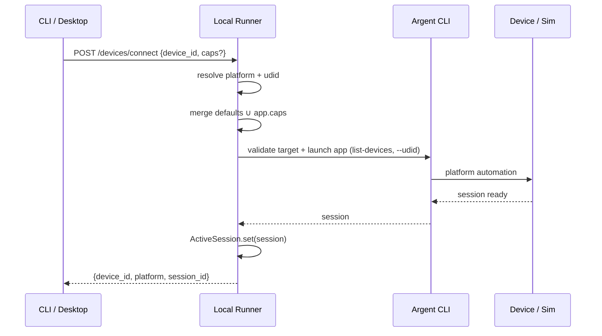
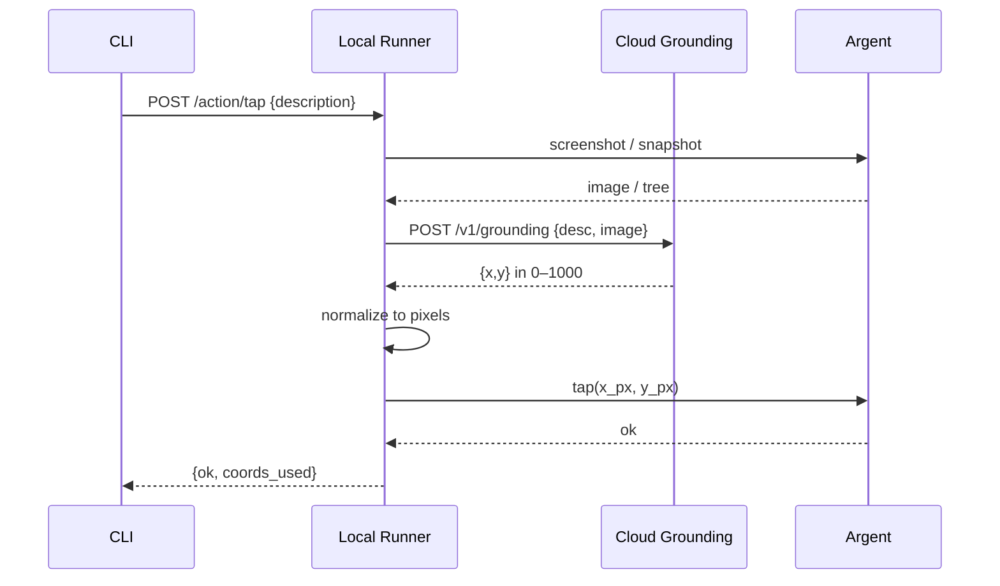
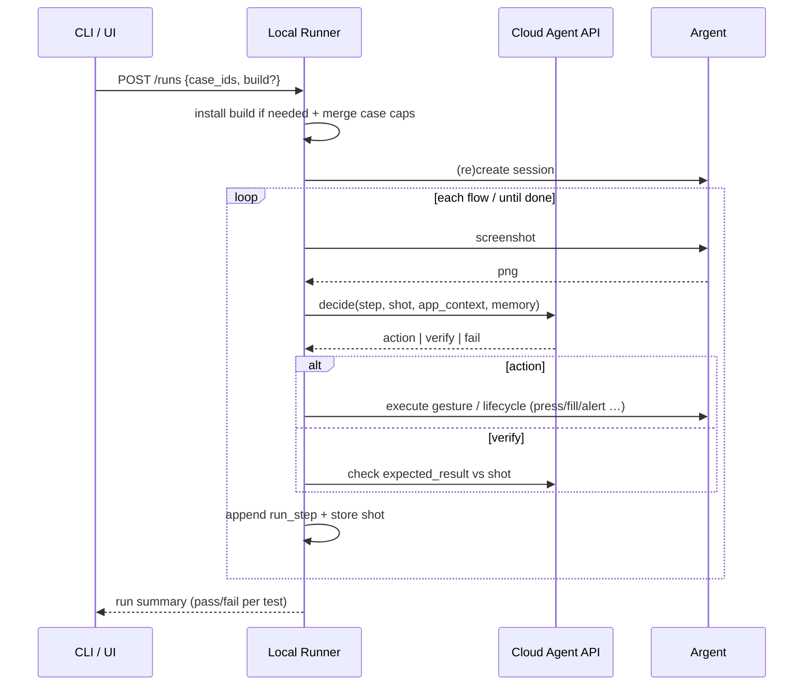

# Yoqa — Feature Spec & Build Architecture

**Product:** Yoqa (`yoqa.ai`) · **Code name:** `qa-agent`

This document is the product design and build architecture for Yoqa: desktop + local runner + Argent + agent skill, with optional cloud later.

Related: public docs in [`apps/docs/`](apps/docs/) (Mintlify) and engineering notes under [`docs/`](docs/).

---

## 1. Product thesis

**Visual, natural-language mobile QA.** An agent tests iOS/Android apps and games from screenshots (and optional cleaned accessibility trees for coding agents), without locator scripts. Device control is **Argent under the hood** (screen trees with refs, semantic selectors, gestures): the runner shells out to the `argent` CLI.

Two complementary modes:

| Mode | Who decides each step | Who pays / when |
|------|------------------------|-----------------|
| **Device connector (CLI)** | External coding agent (`yoqa screen` → `yoqa action` loop) | Free when signed in |
| **Yoqa agent (runs)** | Autonomous perception→decision→action loop | Paid credits |

---

## 2. Complete feature inventory

### 2.1 Desktop app (macOS)

- Local host for device sessions (Argent manages its own runner/tool-server)
- Account sign-in (cloud features, grounding, test management)
- Settings → Tools: **Install CLI**, **Install skill** (`yoqa-testing`)
- Local device / simulator browsing and connection
- Dashboard-like UX for apps, cases, runs, builds (also mirrored in web)
- Auto-update (Electrobun updater via CDN)

### 2.2 Device layer (Argent)

- Discover iOS devices & simulators / Android devices & emulators (`argent run list-devices`)
- Connect a session to a device id (validated via `list-devices`; Argent owns its own tool-server sessions)
- Install / launch apps from local builds (`.ipa`, `.app`, `.apk`)
- Screenshot capture
- Raw snapshot JSON (`screen --full`)
- Gestures: tap / double / long-press, swipe, drag, text input
- App lifecycle: activate, terminate, restart, background
- System: open URL/deeplink, accept/dismiss alerts

### 2.3 Screen reading (for coding agents)

| API | Purpose | Cost (docs) |
|-----|---------|-------------|
| `screen` | Cleaned element tree + relative coords 0–1000 | ~1× tokens |
| `screen --full` | Raw Argent screen snapshot JSON | ~7× |
| `screenshot` | PNG for vision | ~2× |

### 2.4 Automatic grounding

- `action … -d "Blue login button"` → server/model maps description → coordinates
- Fallback: explicit `--x/--y` (0–1000)

### 2.5 Autonomous agent (paid)

Perception → Decision → Action loop from **screenshots** ([how it works](https://docs.yoqa.ai/guide/how-yoqa-agent-works)):

- Actions: tap, swipe, drag, input, open link, terminate/background/activate app
- Works across app + system UI (alerts, IAP, home, other apps)
- Speed: ~5–10s/action cold; ~1–2s with memory of similar screens
- Limits: short-lived UI may be missed; keep tests &lt; ~100 actions

### 2.6 Test authoring model

```
App
├── identifiers: name, bundle_id / package_name, store ids
├── app_context (shared rules, credentials, screen names)
├── launch target (bundle id / package, no custom caps)
├── Tags
├── Reusable Flows (name, instructions, result)
├── Test Cases
│   ├── title, tags[]
│   ├── flows[] → inline {instructions, result} OR {id: reusableFlowId}
│   └── flows[] (no per-case driver caps)
└── Builds (.ipa/.app/.apk, metadata)
Runs
└── cases[] → per-test pass/fail, steps, screenshots/video
```

### 2.7 CLI surface (must implement)

```
devices ios|android [--all]
devices connect <id> | active

screen [--full]
screenshot <path>

action tap|swipe|drag|input …   # -d / --x --y / flags
action open-url|alert|activate-app|terminate-app|restart-app|background-app
action back|scroll|home|keyboard  # --direction / --amount / --action

apps list|get|update
cases list|get|create|update|delete
flows list|get|create|update|delete
tags <APP>
builds list|create|delete
runs create|list|get|wait|report|delete
report [--latest] [--wait] [--github-summary]

--json on read commands
```

### 2.8 Cloud & platform

- Upload builds; run on remote real devices
- Parallel runs, locale/location/preload config
- Public API (API key): apps, builds (+ presigned upload), cases, devices, runs
- CI/CD via API
- Integrations (team): Slack, Jira, webhooks, MCP
- Local vs cloud matrix: TestFlight/simulators local-only; parallel/CI/cloud config cloud-only

### 2.9 Agent skill

Ship `skills/yoqa-testing` (markdown workflows) so Cursor/Claude/Codex know the inspect→act→verify loop.

### 2.10 Best-practice domains (product capabilities)

Product must support:

- Games / canvas / non-native UI (screenshot-first)
- Cross-app flows
- IAP / sandbox purchases
- Cross-platform (shared cases, platform tags)
- App state management (clean install via build flags)

---

## 3. Reference architecture (how we build it)

Desktop + local runner + Argent + optional cloud, implemented in **TypeScript throughout** — Electrobun desktop, Bun runner.

```
┌──────────────────────────────────────────────────────────────────┐
│ CLIENTS                                                          │
│  Desktop (Electrobun/React) │ CLI │ Coding agents │ Web (later)│
└─────────────┬──────────────────┬──────────────────┬──────────────┘
              │ localhost HTTP   │                  │ HTTPS
              ▼                  │                  ▼
┌─────────────────────────────┐  │     ┌──────────────────────────┐
│ LOCAL RUNNER (Bun/TS)       │  │     │ CLOUD API (later)        │
│ Hono : local port           │◄─┘     │ Auth · Apps · Cases      │
│  /devices /screen /action   │        │ Builds · Runs · Billing  │
│  /apps /cases /runs (proxy) │───────►│ Grounding · Agent LLM    │
│ Domain services             │        │ Cloud device farm        │
│ Argent CLI adapter          │        │ Object storage (S3)      │
└─────────────┬───────────────┘        └────────────┬─────────────┘
              │ CLI subprocess (`argent run … --json`)│
              ▼                                       ▼
┌─────────────────────────────┐        ┌──────────────────────────┐
│ Argent (npm/global)         │        │ Remote devices           │
│ iOS sim/devices │ Android   │        │ Video/screenshot ingest  │
└─────────────────────────────┘        └──────────────────────────┘
```

### 3.1 Recommended stack (yoqa)

| Layer | Choice | Why |
|-------|--------|-----|
| Monorepo | **Bun workspaces + Turborepo** | One toolchain for apps/packages |
| Desktop shell | **Electrobun** (Bun main + native WebView) | TS-native desktop, no Rust |
| Desktop UI | **React 19 + Vite + TanStack Router + Query** | Type-safe routes; Start reserved for later web |
| Styling / lint | **Tailwind CSS v4 + Biome** | Shared UI + fast lint/format |
| Local runner | **Bun + Hono + Zod + Drizzle/SQLite** | Same language as desktop/CLI; local catalog in `~/.yoqa/yoqa.db` |
| CLI | **commander** in `packages/cli` (`yoqa` on npm) → HTTP | Thin Node/npx client over localhost runner |
| Device control | **Argent CLI** (`npm i -g @swmansion/argent`) | Screen trees, gestures, app lifecycle; Argent manages its own runner |
| Runtime bundle | Host Node 22+ + Argent on PATH | User installs one npm package; runner shells out |
| Local catalog | **SQLite via Drizzle** in runner | Apps, cases, flows, tags, AI providers (Phase 3+); devices stay live-discovered |
| Cloud API | Later (TanStack Start web + API of choice) | Cases/runs/billing sync — out of Phase 1 |
| Auth / user data | Later | Phase 1 is local-only, no login |
| Agent / grounding | Vision LLM + optional embedding memory | Perception loop + `-d` grounding; local BYO provider instances (API keys, tokens, CLI auth) via Settings → Provider (`/providers`, `resolveActiveProviderAuth()`) until cloud auth |
| Packaging | Electrobun build + DMG | Desktop distribution |
| Docs / skill | Mintlify + `skills/yoqa-testing` | Agent workflows |

### 3.2 Process model (local)

1. User launches desktop app → Electrobun starts **runner sidecar** (`@yoqa/runner`).
2. Runner shells out to the **Argent CLI** (global user installs — `~/.bun/bin`, `~/.local/bin`, Homebrew — then `PATH`).
3. CLI / UI call `http://127.0.0.1:<port>/…` via `@yoqa/runner-client`.
4. Cloud calls (auth, grounding, cases sync, agent run orchestration) go to `api.*` with user token (post–Phase 1).
5. For `runs create`, runner resolves AI auth via `resolveActiveProviderAuth()` (local BYO provider instances from Settings → Provider: Anthropic/OpenAI API keys, Claude/Codex CLI, OpenCode, GitHub Copilot) or later streams screenshots to a cloud agent with a user token.

---

## 4. Core domain modules (implement these)

Modular layout under the runner:

```
services/runner/src/
  index.ts                # Hono app (no managed device server; Argent owns its tool-server)
  settings.ts
  domains/
    argent/               # CLI adapter (`argent run … --json`), device listing, runtime readiness
    devices/              # list, connect, session registry
    testing/              # screen tree cleanup, actions, local runs
    builds/               # register ipa/apk, parse metadata
    apps/                 # local cache of app metadata
    host/                 # host PATH + Android SDK env (kept through the cutover)
    providers/            # Multi-instance AI drivers (API keys / CLI / tokens; encrypted at rest)
    auth/                 # token storage, refresh (post–Phase 1)
    environment/          # CLI symlink, skill install
  interfaces/
    http/                 # REST for desktop + CLI
    cli/                  # `yoqa` entrypoint (commander)
  shared/
    adapters/
      agent.ts            # cloud agent client (later)
      api.ts              # cloud REST client (later)
```

### 4.1 Device session service (critical path)

```text
connect(device_id):
  validate the target via `argent run list-devices`, then launch the app (--udid selector)
  store session in ActiveSession registry

action(cmd):
  if description: coords = await grounding(screenshot|tree, description)
  else: coords = normalize_0_1000_to_pixels(x,y)
  dispatch Argent gesture (gesture-tap / swipe / keyboard / alert …)

screen(cleaned=True):
  source = Argent screen tree
  if cleaned: filter noise, emit {label, type, bounds_rel_0_1000}[]
  else: return raw snapshot JSON
```

### 4.2 Cleaned element tree

Goals: cut token cost vs the raw Argent snapshot while keeping actionable nodes + exact relative boxes.

Heuristics (implement iteratively):

- Drop zero-size / offscreen / pure layout containers
- Deduplicate identical nested labels
- Prefer nodes with name/label/value/clickable/focusable
- Emit relative coords scaled to 0–1000 (width/height independent)

### 4.3 Grounding service (cloud)

```
POST /v1/grounding { screenshot_or_tree, description } → { x, y } in 0–1000
```

Use vision model or tree+LLM. Cache by (app, screen hash, description) for speed.

### 4.4 Autonomous agent loop (cloud or hybrid)

```
while not done and steps < max:
  shot = capture_screenshot()
  plan = llm.decide(shot, instructions, app_context, memory)
  if plan.verify_only: compare expected_result → pass/fail
  else: execute_action(plan.action)
  append step to report (shot, action, latency)
  update screen memory for fast path
```

Memory: embeddings of prior screens → skip full reasoning when similar.

### 4.5 Test case / run model (API)

Entities and public routes to implement early:

- `GET /v1/apps/`
- `GET|POST /v1/builds/`, `POST /v1/builds/presigned-url`
- `GET /v1/cases/`
- `GET /v1/devices/` (cloud catalog)
- `GET|POST /v1/runs/`, `GET /v1/runs/{id}`

Local CLI can proxy these when online; device commands stay local-only.

---

## 5. Desktop UI information architecture

Desktop source is **process-first, feature-nested**: `bun/` (main), `mainview/` (React), `shared/` (RPC/DTOs). UI domains live under `mainview/features/*`; shell/router/RPC client under `mainview/app/`. Main-process logic lives under `bun/features/*` and is exposed only via RPC.

Minimal screens to ship MVP:

1. **Sign in**
2. **Devices** — list/connect iOS & Android
3. **Apps** — CRUD, app context, launch bundle id / package
4. **Test cases** — editor (flows, tags, case caps)
5. **Reusable flows**
6. **Builds** — register local path / upload cloud
7. **Runs** — start, live steps, report (screenshots/video)
8. **Settings** — Tools (CLI + skill), account, runtime status

CLI is a first-class peer of the UI (same local API).

---

## 6. Build plan (phased)

### Phase 0 — Skeleton (1–2 weeks)

- Monorepo: `apps/desktop` (Electrobun+Vite+React), `services/runner` (Bun/Hono), `packages/skill`
- Runner health endpoint; Electrobun spawns sidecar
- Resolve the Argent CLI first (global user installs, then `PATH`)

### Phase 1 — Device connector MVP (core value)

- Device session connect (sim + 1 real device each platform)
- `screenshot`, raw `page_source`, cleaned `screen`
- Coordinate-based `tap/swipe/drag/input` + app lifecycle + alerts
- `yoqa` CLI parity for device/inspect/action
- Skill markdown for inspect→act→verify

**Exit criteria:** coding agent can debug an app via CLI without dashboard.

### Phase 2 — Grounding + auth

- Account auth; signed-in grounding API
- `-d / --description` on actions
- App context storage (local + sync)

### Phase 3 — Test management

- Apps / cases / flows / tags CRUD (**local SQLite via Drizzle in the runner** → cloud sync later)
- Desktop UI talks to runner HTTP (`/apps`, `/cases`, `/flows`, `/tags`); DB file: `~/.yoqa/yoqa.db`
- AI provider connections (`/providers`) for multi-instance drivers — Anthropic, OpenAI, Claude, Codex, OpenCode, GitHub Copilot — with API key / token / CLI probe auth (AES-GCM encrypted secrets; Settings → Provider list + Driver→Identity→Config wizard)
- Launch targets at app level (bundle id / package); no custom driver caps
- Builds register from absolute paths; parse bundle id/version
- Devices remain live-discovered (not stored in SQLite)

### Phase 4 — Autonomous agent runs

- `runs create` orchestration (uses `resolveActiveProviderAuth()` for local BYO keys; cloud token path later)
- Perception loop + reports (steps, screenshots)
- Credit metering
- Screen memory for faster repeats

### Phase 5 — Cloud farm + CI

- Presigned build upload
- Remote devices + parallel runs
- Public API key auth
- CI examples (GitHub Actions)

### Phase 6 — Packaging polish

- Argent global-install guidance (`npm i -g @swmansion/argent`) + telemetry opt-out note
- Electrobun build + DMG + updater CDN
- Argent readiness checks (`doctor`), Android SDK checks

---

## 7. Data model (Postgres sketch)

```sql
workspaces(id, name)
users(id, email, …)
memberships(user_id, workspace_id, role)

apps(id, workspace_id, name, prefix, bundle_id, package_name,
     app_store_id, play_store_id, app_context)

tags(id, app_id, name)
flows(id, app_id, name, instructions, result)          -- reusable
cases(id, app_id, title)
case_tags(case_id, tag_id)
case_flows(case_id, position, instructions, result, flow_id nullable)

builds(id, app_id, name, platform, version, storage_uri, meta jsonb)
runs(id, app_id, build_id, source, status, created_at)
run_tests(id, run_id, case_id, status)
run_steps(id, run_test_id, idx, action jsonb, screenshot_uri, ok, latency_ms)
```

---

## 8. Security & safety boundaries

- Local runner binds **localhost only**
- Cloud API never accepts raw device control of user’s laptop without auth
- No custom driver flags (Argent CLI surface only)
- Secrets (test passwords) in app_context → encrypt at rest
- Sandbox IAP only; document store account requirements
- Quarantine unsigned builds; clear Gatekeeper xattrs on install helpers

---

## 9. Design ownership

Yoqa owns its stack end-to-end:

- Vision / agent prompts and provider wiring (`resolveActiveProviderAuth()`, Settings → Provider)
- Cleaned snapshot-tree heuristics measured against real Argent snapshots
- Branding and bundle ids (`ai.yoqa.app`, `io.yoqa.WebDriverAgentRunner`, `@yoqa/*`)

Product surface we ship: Argent-backed device execution, `yoqa` CLI contract, case/flow model, dual agent modes, Electrobun packaging, and Mintlify docs + `yoqa-testing` skill.

---

## 10. Immediate next engineering tasks

1. Scaffold monorepo (`desktop` + `runner` + `skill`) — Bun + Turborepo.
2. Implement `DeviceSession` + Argent CLI adapter.
3. Implement cleaned `screen` + coordinate actions.
4. Wire `yoqa` CLI → local Hono runner.
5. Add Electrobun window that shows connection status and Install CLI.

---

## 11. Sequence diagrams (core paths)

### 11.1 Device session connect


```mermaid
sequenceDiagram
  participant CLI as CLI / Desktop
  participant R as Local Runner
  participant A as Argent CLI
  participant D as Device / Sim

  CLI->>R: POST /devices/connect {device_id, caps?}
  R->>R: resolve platform + udid
  R->>R: merge defaults ∪ app.caps
  R->>A: validate target + launch app (list-devices, --udid)
  A->>D: platform automation
  D-->>A: session ready
  A-->>R: session
  R->>R: ActiveSession.set(session)
  R-->>CLI: {device_id, platform, session_id}
```

### 11.2 Grounded action (`-d` description)


```mermaid
sequenceDiagram
  participant CLI as CLI
  participant R as Local Runner
  participant G as Cloud Grounding
  participant A as Argent

  CLI->>R: POST /action/tap {description}
  R->>A: screenshot / snapshot
  A-->>R: image / tree
  R->>G: POST /v1/grounding {desc, image}
  G-->>R: {x,y} in 0–1000
  R->>R: normalize to pixels
  R->>A: tap(x_px, y_px)
  A-->>R: ok
  R-->>CLI: {ok, coords_used}
```

### 11.3 Autonomous agent run


```mermaid
sequenceDiagram
  participant CLI as CLI / UI
  participant R as Local Runner
  participant C as Cloud Agent API
  participant A as Argent

  CLI->>R: POST /runs {case_ids, build?}
  R->>R: install build if needed + merge case caps
  R->>A: (re)create session
  loop each flow / until done
    R->>A: screenshot
    A-->>R: png
    R->>C: decide(step, shot, app_context, memory)
    C-->>R: action | verify | fail
    alt action
      R->>A: execute gesture / lifecycle (press/fill/alert …)
    else verify
      R->>C: check expected_result vs shot
    end
    R->>R: append run_step + store shot
  end
  R-->>CLI: run summary (pass/fail per test)
```

---

## 12. Phase 1 file tree (current + target seams)

Canonical layout notes: [`docs/architecture/current-layout.md`](docs/architecture/current-layout.md). Domain vocabulary: [`CONTEXT.md`](CONTEXT.md). Decisions: [`docs/adr/`](docs/adr/).

```
repo/
├── apps/
│   └── desktop/                      # Electrobun + Vite + React + TanStack Router
│       └── src/
│           ├── bun/                  # main process (ios-toolchain prefs RPC)
│           ├── shared/               # RPC contracts
│           └── mainview/features/    # apps, devices, inspector, settings, runs UI
├── services/
│   └── runner/                       # @yoqa/runner (Bun + Hono)
│       └── src/
│           ├── settings.ts           # listen host/port/version (not product prefs)
│           ├── domains/
│           │   ├── devices/          # Device Session, Screen, Action, Active Session
│           │   ├── argent/          # Argent CLI adapter + runtime readiness
│           │   ├── doctor/          # doctor report + repairs
│           │   ├── host/            # host PATH + Android SDK env (kept through the cutover)
│           │   ├── providers/        # Provider adapters + vision completion
│           │   ├── runs/             # Run orchestration + Case executor + agent prompts
│           │   ├── catalog/          # apps, cases, flows
│           │   └── builds/
│           └── interfaces/http/      # thin Zod + status mapping (session, runs, …)
└── packages/
    ├── cli/                          # `@yoqa/cli` → runner HTTP
    ├── runner-client/                # typed client + Zod schemas
    ├── ui/
    ├── typescript-config/
    └── skill/yoqa-testing/
```

**Module responsibilities (target)**

| Module | Owns |
|--------|------|
| `devices/` Device Session | create/attach, gestures, screenshots, Dead Session errors; Active Session registry |
| `devices/` Screen & Action | `getScreen`, `performAction` (incl. Grounding) |
| `argent/` | Argent subprocess adapter (`argent run … --json`; sessions, screen trees, gestures, installs) + runtime readiness |
| `providers/` | probe/validate/listModels + optional decide/ground; catalog for Settings UI |
| `runs/` Case executor | one case with injected session/decide/clock/abort; uses Screen & Action |
| `packages/cli` | thin HTTP client to local runner |

---

## 13. Feature checklist (synced to [llms.txt](https://docs.yoqa.ai/llms.txt))

Legend: `[ ]` not started · `[~]` Phase 1 scoped · `[x]` done

### Product docs surface

| Doc area | Features to cover | Status |
|----------|-------------------|--------|
| [Overview](https://docs.yoqa.ai/docs/overview) / [Quickstart](https://docs.yoqa.ai/docs/quickstart) | NL tests → device → build → run → report | [ ] |
| [Desktop app](https://docs.yoqa.ai/docs/desktop-app) | Local Mac host, Tools install | [~] |
| [Device preparation](https://docs.yoqa.ai/docs/device-preparation) | Xcode/adb readiness checks | [ ] |
| [Local builds](https://docs.yoqa.ai/docs/local-builds) | `.ipa/.app/.apk` register & install | [ ] |
| [Apps](https://docs.yoqa.ai/docs/apps) | name, bundle/package, store ids, context | [ ] |
| [Test cases](https://docs.yoqa.ai/docs/test-cases) | flows, tags | [ ] |
| [CLI](https://docs.yoqa.ai/docs/cli) | devices/screen/action/apps/cases/flows/builds/runs | [~] |
| [CLI for agents](https://docs.yoqa.ai/guide/cli-for-agents) | skill + inspect→act→verify | [~] |
| [How agent works](https://docs.yoqa.ai/guide/how-yoqa-agent-works) | perception loop, memory, limits | [ ] |
| [Writing test cases](https://docs.yoqa.ai/guide/writing-test-cases) | app_context, reusable flows | [ ] |
| Local vs cloud | capability matrix | [ ] |
| Cloud / Cloud builds / CI/CD | farm, upload, pipeline | [ ] |
| Device capabilities (removed) | ~~merge + autoLaunch/activity~~ — custom driver caps were an Appium concept; the Argent backend needs none | [x] |
| Best practices: [state](https://docs.yoqa.ai/guide/best-practices-app-state), [cross-app](https://docs.yoqa.ai/guide/best-practices-cross-app), [cross-platform](https://docs.yoqa.ai/guide/best-practices-cross-platform), [games](https://docs.yoqa.ai/guide/best-practices-games), [IAP](https://docs.yoqa.ai/guide/best-practices-iap), [non-native](https://docs.yoqa.ai/guide/best-practices-non-native-ui) | product behaviors / guides | [ ] |

### Public API (planned)

| Endpoint | Status |
|----------|--------|
| `GET /v1/apps/` | [ ] |
| `GET /v1/builds/` · `POST /v1/builds/` · `POST /v1/builds/presigned-url` | [ ] |
| `GET /v1/cases/` | [ ] |
| `GET /v1/devices/` (cloud catalog) | [ ] |
| `GET\|POST /v1/runs/` · `GET /v1/runs/{id}` | [ ] |

---

## References

- [How Yoqa agent works](https://docs.yoqa.ai/guide/how-yoqa-agent-works)
- [CLI](https://docs.yoqa.ai/docs/cli)
- [CLI for agents](https://docs.yoqa.ai/guide/cli-for-agents)
- [Writing good test cases](https://docs.yoqa.ai/guide/writing-test-cases)
- [Docs index](https://docs.yoqa.ai/llms.txt)
- [Product site](https://yoqa.ai/)
- Local: [`apps/docs/`](apps/docs/), [`docs/`](docs/)
